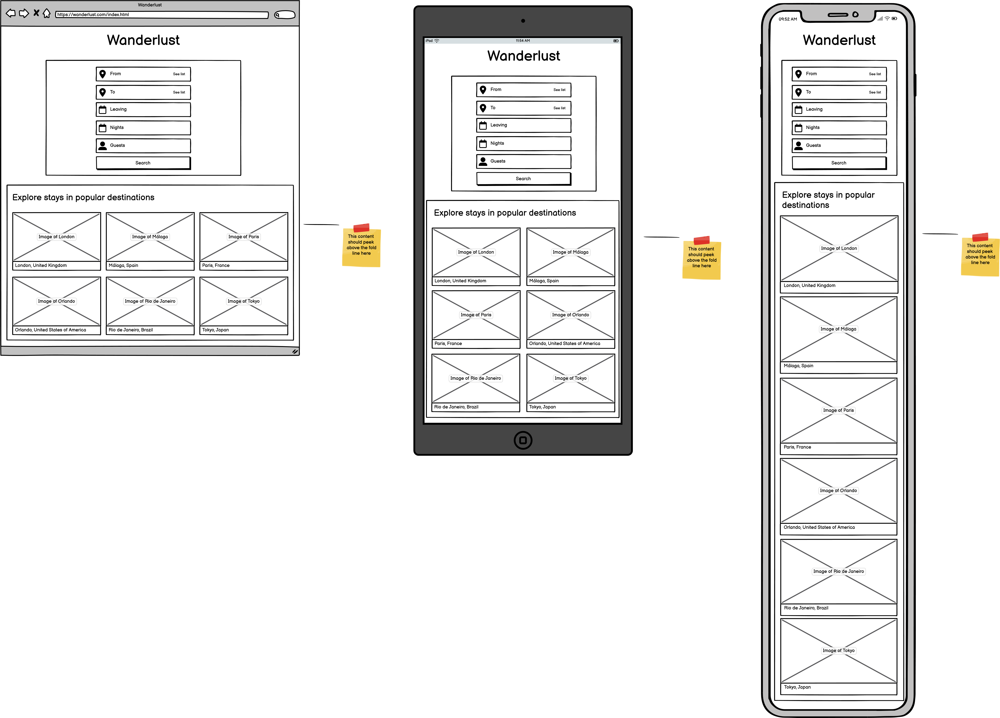
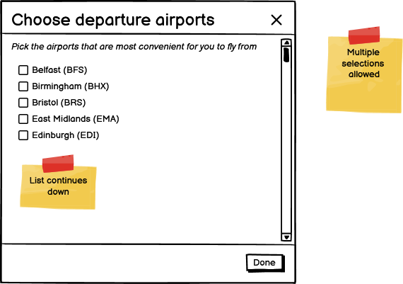
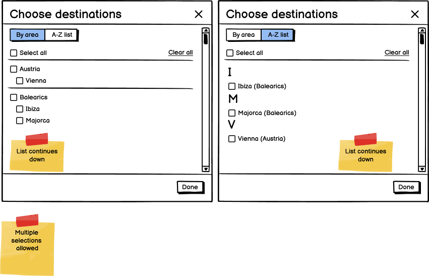
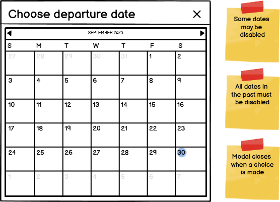
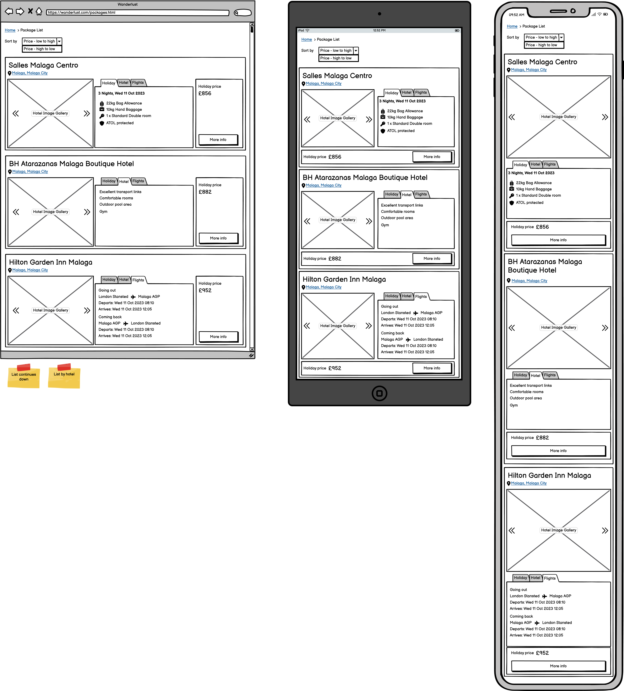

# Wanderlust

## Table of Contents

- [UX](#ux)
  - [Strategy](#strategy)
    - [Business Goals](#business-goals)
    - [User Goals](#user-goals)
    - [User Demographic](#user-demographic)
    - [Competitor Research](#competitor-research)
    - [Prioritization Grid](#prioritization-grid)
  - [Scope](#scope)
    - [Allow the user to choose from one of a set of travel packages](#allow-the-user-to-choose-from-one-of-a-set-of-travel-packages)
    - [Provide a user interface that is similar to what is provided by competitors' websites](#provide-a-user-interface-that-is-similar-to-what-is-provided-by-competitors-websites)
    - [Provide a user interface which is a display of a 3D spinning globe with city markers](#provide-a-user-interface-which-is-a-display-of-3d-spinning-globe-with-city-markers)
  - [Structure](#structure)
    - [Home Page](#home-page)
    - [Package List Page](#package-list-page)
    - [Package Details Page](#package-details-page)
  - [Skeleton](#skeleton)
  - [Surface](#surface)
- [Technologies Used](#technologies-used)
- [Testing](#testing)
- [Deployment](#deployment)

## UX

### Strategy

#### Business Goals

The purpose of the business, Wanderlust, is to provide customers with package holidays.

1. To advertise their package holiday products.
2. To allow customers to purchase them.

#### User Goals

1. To find a package holiday offered by Wanderlust.
2. To purchase a package holiday through the website.

#### User Demographic

The target users of this website are new or existing customers who enjoy travel and are looking for a destination for their next trip.

- Roles:
  - New users
  - Current users
- Demographic:
  - Age 20 - 40
  - UK residents
  - Affluent
- Pyschographic:
  - Adventurous

#### Competitor Research

The following competitor websites will be researched to consider their design choices when offering package holidays:

- Expedia
- TUI
- Jet2Holidays

##### Expedia

Expedia's design, under the "Packages" tab, features a prominent form at the top of the website that requires the user's desired departure and arrival destinations, leaving and returning dates, and number of rooms/guests. A prominent "Search" button initiates the search.

Below this is a list of popular holiday destinations that the user can tap to search holidays with one gesture.

The results are shown as a paged list of cards with a photo, title, rating and price.

Tapping on a result takes the user to a page where they can see more details about the hotel, including local amenities, attractions, and a Google Maps view of the area. From here they can choose a room and go on to book and pay.

##### TUI

TUI's design begins on a selected "Package Holidays" tab. Under this is a prominent form that require's the user's desired departure and arrival destinations, leaving date, desired nights and number of rooms/guests. A prominent "Search" button initiates the search.

Below this is a list of deals based on location, holiday type, or dates. Users can search a list of packages matching these criteria with one gesture.

The results are shown as a list of cards with a photo, title, link to reviews, price, and more details about the hotel and flights.

Tapping on a result takes the user to a page where they can see more details about the hotel, including amenities, attractions, and a Google Maps view of the area. From here they can choose the customize certain details, then go on to book and pay.

##### Jet2Holidays

Jet2Holidays's design features a prominent form at the top of the website that requires the user's desired departure and arrival destinations, leaving date, desired nights and number of rooms/guests. A prominent "Find my holiday" button initiates the search.

Below this is a list of popular holiday destinations that the user can tap to search holidays with one gesture.

The results are shown as a paged list of cards with a photo, title, rating, price and more details about the hotel and flights.

Tapping on a result takes the user to a page where they can see more details about the hotel, including local amenities, attractions, and a Google Maps view of the area. From here they can choose to go on to book and pay.

##### Competitor Research Evaluation

It is clear from looking at competitors' websites that they have a very similar design. This leads me to believe that by trial and error the have converged on a similar design, and that this is what users will expect when they are trying various websites to choose a holiday. Therefore it would be wise to imitate this design.

#### Prioritization Grid

<em>Click to expand grid image</em>

 

| Number | Opportunity/Problem                                                                   | Importance | Viability/Feasibility |
| ------ | ------------------------------------------------------------------------------------- | ---------- | --------------------- |
| 1      | Allow the user to choose from one of a set of travel packages                         | 10         | 10                    |
| 2      | Provide a user interface that is similar to what is provided by competitors' websites | 8          | 10                    |
| 3      | Provide a user interface which is a display of a 3D spinning globe with city markers  | 4          | 4                     |
| 4      | Provide registration and login functions                                              | 6          | 2                     |
| 5      | Allow purchasing through the website                                                  | 8          | 4                     |
|        |                                                                                       | **36**     | **30**                |

##### 1. Allow the user to choose from one of a set of travel packages

This problem has maximum importance because it is vital to fulfilling the users' and business's goals established above. It is highly feasible because at its most basic it is simply a matter of presenting fixed data.

##### 2. Provide a user interface that is similar to what is provided by competitors' websites

This problem has high importance because it has been established that our competitors' all have a similar user interface, and therefore users will be expecting this from other websites. There is an option to go with a radically different user interface, so this has been given high but not maximum importance. Feasibility is high because it will be relatively simple to implement thanks to UI frameworks like Bootstrap.

##### 3. Provide a user interface which is a display of a 3D spinning globe with city markers

This problem has a low importance because it will be a radical departure from a standard UI which may throw off a casual user. However, it could also be an interesting feature that will hook a new user. It's feasibility is low because it will require complicated CSS and/or JS to implement, and may have performance implications especially on mobile devices.

##### 4. Provide registration and login functions

This problem has been given medium importance because it is important, though not vital, to fulfill business goal #2 and user goal #2. The ability to have a user account associated with a website through which purchases are made is important to allow a user to track their purchases. Its feasibility is low because it will require careful security considerations, and perhaps an SSL certificate and a database back end.

##### 5. Allow purchasing through the website

This problem has been given high importance because it is vital to fulfil business goal #2 and user goal #2. It has been given low feasibility because it will require careful security considerations, and probably an SSL certificate.

##### Priority Evaluation

It is recommended that the first release should focus on delivering a minimum viable product (MVP) which aims to fulfil business goal #1 and user goal #1, with a view to fulfilling business goal #2 and user goal #2 in a later release. This is due to their need for careful consideration of their security implications. Therefore problems #4 and #5 will be relegated to future releases.

Problems #1 and #2 are vital to fulfilling business goal #1 and user goal #1 and have high feasibility so these will be the focus of the first release.

Problem #3 refers to a radically different UI from our competitors. It is recommended that this be implemented as an optional UI that can be toggle on or off in place of a traditional UI, thus facilitating A/B testing to determine its acceptability. This will be the lowest priority goal of the MVP, and will only be implemented after problems #1 and #2 have been satisfactorily solved, and with time permitting.

[↑ Back to top](#wanderlust)

### Scope

The scope plane is about defining requirements based on the goals established on the strategy plane.

#### Allow the user to choose from one of a set of travel packages

##### Data Storage

A mock data store will be used to back the website. The fetch API will be used to get data from a JSON file. This will avoid the need to build a real back end for the website, allowing development of the front end to continue independently of the back end.

The data store will contain a structured dataset representing the information about the available travel packages such as location, flights, hotels and price.

#### Provide a user interface that is similar to what is provided by competitors' websites

##### Map View

A common feature of our competitors' websites' UIs is that they include a map view of the chosen hotel. [Google Maps API](https://developers.google.com/maps/documentation/javascript) can facilitate this.

##### Local Attractions

A common feature of our competitors' websites' UIs is that they include a list of local attractions. The [Google Places API](https://developers.google.com/maps/documentation/javascript/places) can be used to get information about these places.

#### Provide a user interface which is a display of 3D spinning globe with city markers

[Preliminary testing](https://davidmorgan92.github.io/three-test/) has shown that [three.js](https://threejs.org/) can be leveraged to provide this functionality. Additionally, there are [examples](https://codepen.io/ksenia-k/pen/NWERpmb) to be found on the internet of this kind of functionality being implemented.

[↑ Back to top](#wanderlust)

### Structure

The website will utilize a linear narrative navigation for maximum simplicity. From the home page the user will complete a search form which will present a list of matching packages. Or they will select from a list of advertised package types which will take them to the same package list page. When they select a package it will take them to a package details page where they can see all details about the chosen package.

#### Home Page

The home page will have two main elements:

1. A search form which when submitted will take the user to the package list page
2. A list of advertised package types which will be hinted above the fold

Submission of the form, or tapping an advertised package type will take them to the package list page.

In the design with the 3D spinning globe then each city that has a package will be highlighted on the globe with a circle. Mousing over the circle will reveal a tooltip with the city's name and its number of packages. Clicking on the circle will take the user to the package list page for all packages in that city.

##### Search Form Input

The three websites chosen for competitor research all have slightly different ways of inputting data into the search form. I will choose to imitate that provided by Jet2Holidays because it appears easy to use and to implement which is suitable for a minimum viable product.

The inputs are:

1. From
2. To
3. Leaving
4. Nights
5. Guests

Apart from the Guests input, which can be changed at any time, the inputs must be completed in order; subsequent inputs are disabled until the preceding ones are filled.

The From input is a [combo box](https://en.wikipedia.org/wiki/Combo_box) for the departure airport. Additionally there is a button to show a modal which contains a list of departure airports. This allows choosing multiple options.

The To input is a combo box for either the destination city, country, or hotel name. There is a button to show a modal which contains a list of destinations sorted alphabetically first by country then city.

The Leaving input when clicked shows a modal which contains a date picker that allows a single selection. Not all dates are allowed.

The Nights input is a drop down that allows a simple integer selection. Not all integer values are allowed.

The Guests input shows a modal with with an array of Room cards. There is a button to allow the user to add a Room. Each Room card has an X button to remove it in the corner, as long as there is more than one in the array. Each Room card has a number input for the number of adults (minimum 1) and number of children (total of both must not be more than 8). The total number of people booked must not be more than 19 across all rooms. A phone number is provided to allow customers to make larger group bookings.

Once all these inputs are complete and valid the search button will be enabled.

#### Package List Page

The package list page will be a scrollable list of cards. Each card will show a summary of the package's details like price and location.

This page will feature breadcrumbs at the top to allow the user to go back to the home page.

There will be a dropdown menu to select sorting options:

1. Price - low to high
2. Price - high to low

#### Package Details Page

The package details page will provide a space for the user to see all details about the package they have selected.

This page will feature breadcrumbs at the top to allow the user to go back to the package list page or to the home page.

[↑ Back to top](#wanderlust)

### Skeleton

[Balsamiq Wireframes project file](documentation/wanderlust.bmpr)

Home Page

From Modal

To Modal

Leaving Modal

Package List Page

 

[↑ Back to top](#wanderlust)

### Surface

[↑ Back to top](#wanderlust)

## Technologies Used

## Testing

## Deployment
