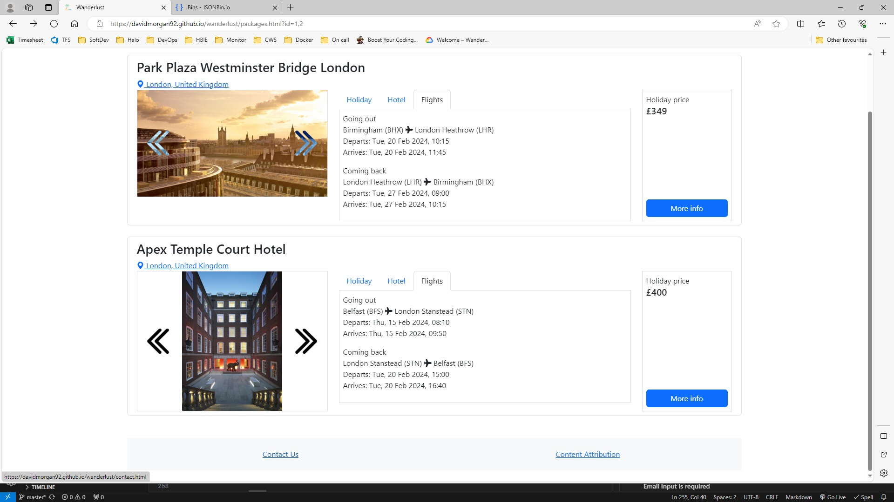
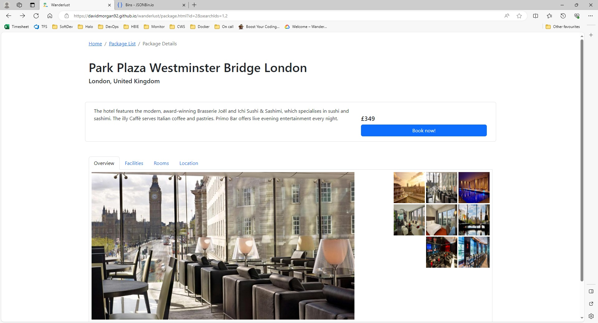
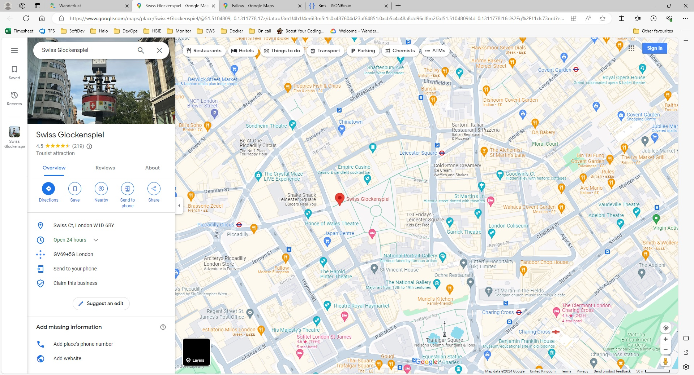

# Testing

## Table of Contents

- [Automated testing](#automated-testing)
- [Manual testing](#manual-testing)
  - [Home](#home)
  - [Package List](#package-list)
  - [Package Details](#package-details)
  - [Contact Us](#contact-us)

## Automated testing

The project makes use of automated testing by using Jest. Run `npm test` to run the tests.

Test run results:

## Manual testing

### Home

#### Form requires all values to be entered to submit

From required

To required

Leaving required

Nights required

Guests required

#### Leaving date can't be in the past

Leaving date can't be in the past (test performed on 09/02/2024)

#### From input only accepts valid values

Before (invalid value entered)

After (from input has lost focus)

#### To input only accepts valid values

Before (invalid value entered)

After (to input has lost focus)

#### Nights input must be greater than or equal to 1

Nights input must be greater than or equal to 1

#### Guests input must be greater than or equal to 1

Guests input must be greater than or equal to 1

#### London popular destinations link works

Before (invalid value entered)

After (to input has lost focus)

#### Malaga popular destinations link works

#### Paris popular destinations link works

#### Orlando popular destinations link works

#### Rio de Janeiro popular destinations link works

#### Tokyo popular destinations link works

#### Home Contact Us link works

#### Home Content Attribution modal works

 

[↑ Back to top](#testing)

### Package List

#### Search results are sorted by price low to high by default

Evidence

#### Search results can be sorted by price high to low

Evidence

#### Image gallery scrolling works

Before

After (left button clicked)

After (right button clicked)

#### Holiday data is loaded correctly

Evidence

Defect: The number of rooms is not correctly loaded based on the number of guests stated in the search form.

Defect: The number of nights and the leaving date of the holiday is not correctly loaded.

This functionality has not been implemented yet due to time constraints.

#### Hotel data is loaded correctly

Evidence

#### Flights data is loaded correctly

Evidence

#### Price data is loaded correctly

Evidence

#### More info link works

Before

After

#### Package List Contact Us link works

Before

After

#### Package List Content Attribution modal works

Before

After

#### Package List Breadcrumb link to home page works

Before

After

 

[↑ Back to top](#testing)

### Package Details

#### Image gallery works on small screens

Before

After (left button clicked)

After (right button clicked)

#### Image gallery works on medium screens

Before

After (thumbnail clicked)

After (scroll right button clicked)

After (scroll left button clicked)

Defect: The thumbnails do not scroll to the left by 100px as designed. Instead the thumbnails jump to the scroll position of zero.

#### Image gallery works on large screens

Before

After (thumbnail clicked)

#### Book now link works

Before

After

#### Hotel name, location, blurb and price are loaded correctly

Evidence

#### Facilities data is loaded correctly

Evidence

#### Rooms data is loaded correctly

Evidence

#### Location data is loaded correctly

Location

#### Package Details Contact Us link works

Before

After

#### Package Details Content Attribution modal works

Before

After

#### Nearby restaurants links work

Before

After

#### Nearby attractions links work

Before

After

#### Package Details Breadcrumb link to home page works

Before

After

#### Package Details Breadcrumb link to package list page works

Before

After

 

[↑ Back to top](#testing)

### Contact Us

#### Name input is required

#### Email input is required

#### Email input requires valid email input

#### Message input is required

#### Contact Us Content Attribution modal works

#### Contact Us Breadcrumb link to home page works

#### Email message successfully sends
